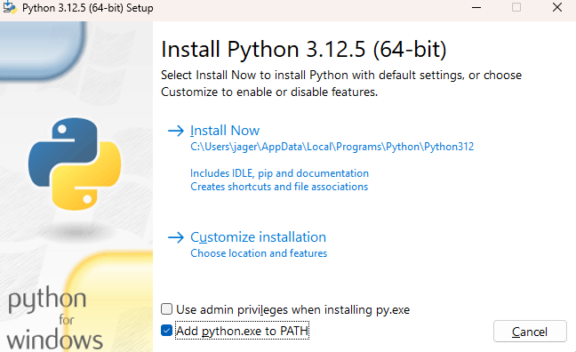
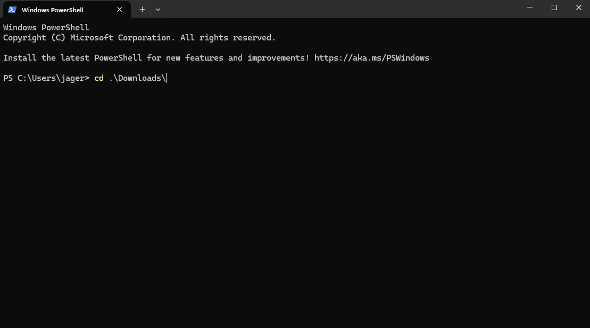

# Epic Dot Method Script

This script does the dot method to quickly create realod smurfs hands-free
It only has *full* support for 1440p as of right now. It will create the info for 1080p

## Guide
* Navigate to the python website by clicking [this](https://python.org/downloads)
*  Select the Download Python 3.12.5 option

* Run the exe
* Make sure to check "add python.exe to PATH" at the bottom or it won't work
* 
* Click "Install Now". If the installation fails, try again but check the run as administration option
* Now press the windows key and type powershell and press enter

##### Now run the following commands one by one
* pip install webdriver-manager
* pip install selenium
* pip install pyautogui
* pip install pugetwindow

##### Once these are done running. Navigate to the directory that foo.py is located in (probably downloads)
* Use the following command to navigate to Downloads

## Runtime info
Once you are there, the the following command
* python foo.py what@gmail.com password123 "username"
#### Replace the inputs with your own
**By default** it auto-generates a username
#### On line 465, put a '#' in front of 'GENNERATED_NAME = generate_username()' to use your own names
#### Username must be in quotes if you want a space in it

